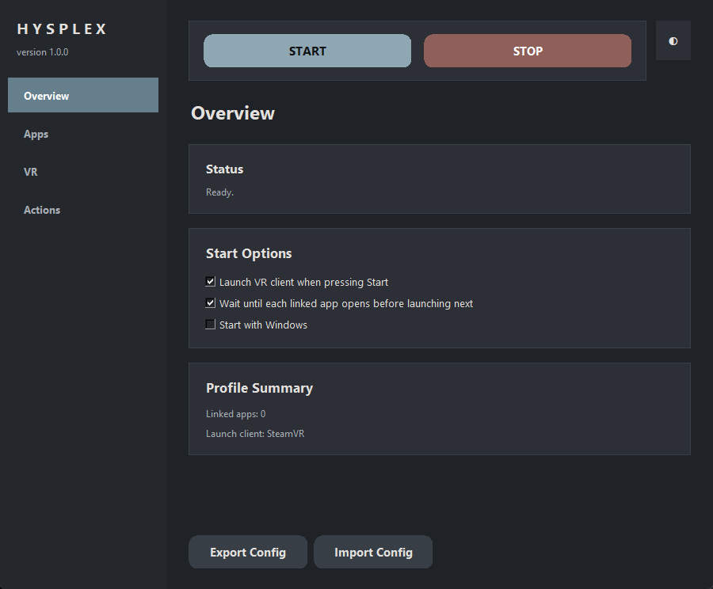
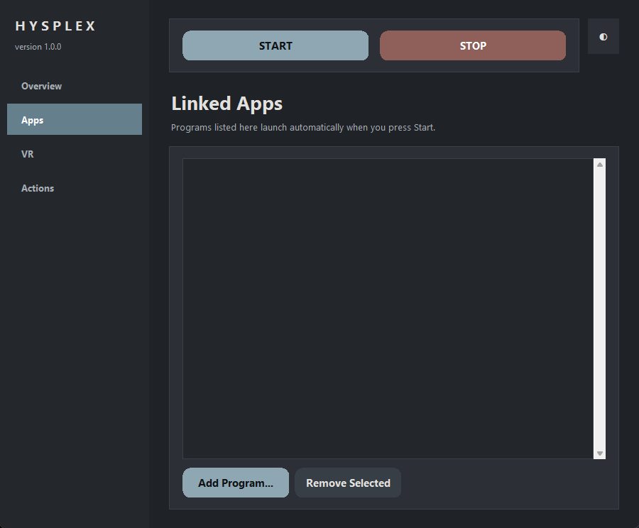
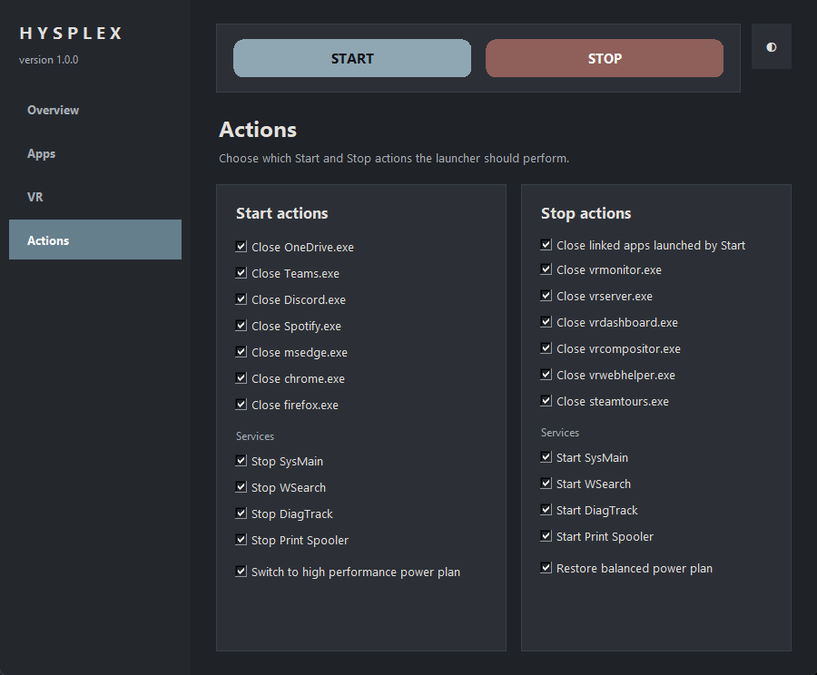

# Hysplex

**Hysplex** is a Windows desktop launcher for sim racing and VR sessions. It can start your VR client, launch your sim racing tools, switch power plans, and restore your normal desktop setup when you stop.

## Features

- Start/stop VR mode from a simple Tkinter GUI
- Launch common VR clients:
  - SteamVR
  - Meta Quest Link
  - Virtual Desktop Streamer
  - Windows Mixed Reality
  - Pimax Play
  - Custom executable
- Launch linked sim racing apps sequentially or all at once
- Optional process cleanup for distracting/background apps
- Optional Windows service stop/start actions
- Optional high-performance/balanced power plan switching
- Config import/export
- Optional Start with Windows shortcut
- Built-in UI themes: Graphite, Fire, Ice, Acid

## Safety note

Hysplex can optionally close processes, stop/start Windows services, change the active power plan, and create/remove a Startup folder shortcut. Review the options in the app before using Start/Stop.

Some actions may require administrator permissions depending on your Windows configuration.

## Download

For normal use, download the latest Windows zip from the project's GitHub **Releases** page, extract it, and run:

```text
H Y S P L E X.exe
```

## Screenshots



| Linked apps | VR client | Actions |
| --- | --- | --- |
|  |  |  |

## Configuration

Hysplex stores its local configuration in:

```text
hysplex_apps.json
```

When running the packaged executable, this file is created next to the `.exe`. This file may contain personal local paths, so it is intentionally ignored by Git.

A clean example is provided in:

```text
hysplex_apps.example.json
```

## Run from source

Requirements:

- Windows
- Python 3.11+ recommended

Run:

```powershell
python Hysplex.py
```

Or, to avoid a console window on Windows:

```powershell
pythonw Hysplex.pyw
```

## Build from source

Install PyInstaller:

```powershell
python -m pip install pyinstaller
```

Build:

```powershell
pyinstaller Hysplex.spec
```

The executable will be created under `dist/`.

## License

Hysplex is licensed under the GNU General Public License v3.0 or later. See [LICENSE.txt](LICENSE.txt).


[](https://ko-fi.com/O8K62505OD)
